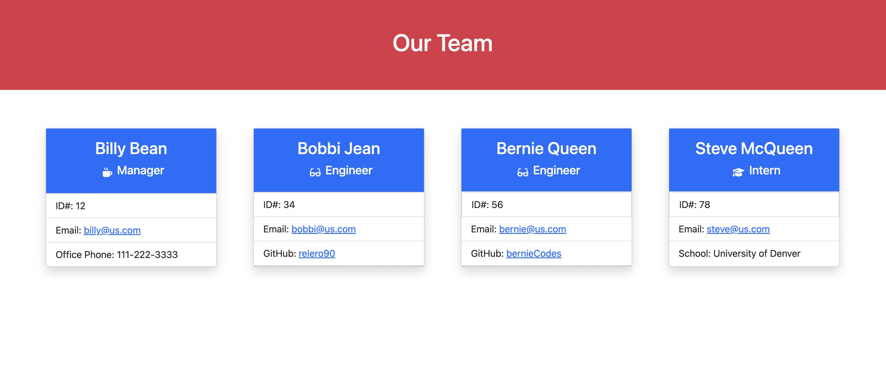

# Team Profile Generator

## Table of Contents

---

1. [Description](#description)
1. [Demo](#demo)
1. [Usage Recommendations](#usage_recommendations)
1. [Testing](#testing)

## Description

---

This is a command line app designed to dynamically create a pre-styled profile webpage for your entire engineering team. The user answers prompts in the command line to add a manager, engineers, and interns to the html webpage. The result is a quick and easy profile webpage to facilitate ease of access to employee position and contact information.

## Demo

---

View the following demonstration video to see the team profile generator in action:
[Demo Video](https://watch.screencastify.com/v/gIUyzqZ6ByoJp3R3aJd8)

## Usage Recommendations

---

To use this app to create your own employee profile page, clone the repository code to your local device. From the command line, pass `node index.js build-team`

## Testing

---

To test this app, pass: `npm run tests`
